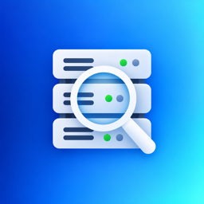

<div align="center">
  
  <h1>vLens</h1>
  <p><strong>Native macOS vCenter/ESXi inventory — inspired by RVTools, with features RVTools doesn't have.</strong></p>

  <p>
    
    
    
    
  </p>
</div>

---

vLens pulls vCenter/ESXi inventory into a fast, native SwiftUI window — every
VM, host, datastore, network, and license, sortable and searchable, exportable
to CSV or XLSX. If you've used RVTools on Windows, the data will look
familiar; the app won't. No .NET, no VM/Wine, no Windows box just to run a
reporting tool.

It covers essentially everything RVTools does (27 tabs total, 23 of RVTools'
24 documented tabs — only `vFileInfo` is missing) — but it isn't just a port.
vLens adds several things RVTools doesn't have: historical performance
trends, point-in-time inventory snapshots you can compare, a one-page PDF
management report, and quiet awareness of published VMware security
advisories.

**Status**: signed, notarized, and distributed — see
[Releases](https://github.com/canberkys/vlens/releases) for a ready-to-run
DMG, or [Building from source](#building-from-source) below. Sparkle checks
that feed automatically and offers in-app updates. Still in active
development, and not yet validated against a real vCenter 7/8/9 environment
(everything so far is verified against
[vcsim](#testing-without-a-real-vcenter), govmomi's protocol-accurate
simulator).

---

## Features

| | |
|---|---|
| **27 tabs** | vInfo, vCPU, vMemory, vDisk, vSnapshot, vTools, vNetwork, vCD, vUSB, vPartition, vApp, vHost, vDatastore, vCluster, vRP, vSwitch, vPort, dvSwitch, dvPort, vNic, vSC+VMK, vHBA, vMultipath, vLicense, vHealth, plus vLens' own vPerformance and Snapshots |
| **RVTools parity** | Only `vFileInfo` (datastore file browser) is deliberately out of scope — RVTools' own docs flag it as slow and rarely used |
| **vHealth** | 10 of RVTools' 24 documented health-check rules, thresholds adjustable in Preferences, re-evaluates instantly on change |
| **vPerformance** *(not in RVTools)* | Historical CPU/RAM/disk-IO usage over a time window you choose (1 hour–30 days), not just an instantaneous snapshot |
| **Snapshots & Compare** *(not in RVTools)* | Record a point-in-time set of inventory metrics, compare any two later with a color-coded delta |
| **PDF report** *(not in RVTools)* | One-page management summary — vCenter identity, counts, charts, vHealth status — generated on demand |
| **Security advisories** *(not in RVTools)* | Quiet toolbar badge when Broadcom publishes a CRITICAL/HIGH VMware security advisory |
| **Export** | CSV and XLSX, whatever the current tab shows, already filtered by search |
| **Trust-on-first-use** | Certificate fingerprint shown and pinned on first connect, like SSH host keys — a changed certificate later is a hard block, never silent |
| **Demo mode** | Every tab filled with realistic mock data — try the whole app without a vCenter |
| **In-app Help & onboarding** | Native Help panel (no external site), one-time welcome + per-feature tips |
| **In-app feedback** | Bug reports / feature requests via email or a prefilled GitHub issue — no telemetry, nothing sent without you reviewing and sending it yourself |

---

## Building from source

No public release yet — build it yourself:

```bash
git clone https://github.com/canberkys/vlens.git
cd vlens

# Swift app
swift build
swift test

# Go helper (vCenter client — see Architecture below)
cd helper
go build -o vlens-helper .
cd ..

# Run
swift run vLens
```

**Requirements:** macOS 14 Sonoma or later, Swift 6.0+, Go 1.27+.

To produce a signed, packaged `.app` (requires your own Apple Developer ID —
see `scripts/release.sh` for the one-time `notarytool` setup):

```bash
./scripts/release.sh
```

---

## Testing without a real vCenter

vLens ships with dev-only tooling built on [`vcsim`](https://github.com/vmware/govmomi/tree/main/vcsim)
— govmomi's own simulator, the same engine behind the upstream `vcsim` CLI. It's
a real SOAP/PropertyCollector server, not a mock; `vlens-helper` talks to it
exactly as it would talk to a real vCenter.

```bash
cd helper
go run ./vcsim              # small model, fast iteration
go run ./vcsim -bulk        # ~1,200 VMs / 34 hosts / 4 clusters / 12 datastores
```

Point vLens's Connect screen at the printed `https://127.0.0.1:PORT/sdk` URL
with username `user` / password `pass` (vcsim accepts anything), approve the
self-signed certificate, and every tab fills with real (simulated) data.
`collectAll` finishes in well under a second even at the bulk scale.

---

## Architecture

```
Sources/vLens/       SwiftUI app — connect screen, tabs, Help, Preferences, Feedback
Sources/vLensCore/   Shared library — models, health checks, export, local stores
helper/              Go module (govmomi) — the actual vCenter client
```

vLens talks to vCenter through an embedded Go binary (`vlens-helper`), not a
pure-Swift SOAP client — Swift has no maintained vSphere SDK, and
[govmomi](https://github.com/vmware/govmomi) (the same library behind
Terraform's, Packer's, and Kubernetes' vSphere providers) already solves that
problem well. The Swift app and helper speak a small JSON protocol over
stdin/stdout — one process per collection, one login, one `PropertyCollector`
pass per vim25 object type.

Full architecture rationale, every tab's exact data source, and the complete
vHealth rule status live in [`docs/vLens-Reference.md`](docs/vLens-Reference.md).

---

## Data stored locally

```
~/Library/Application Support/vLens/
  connection-profiles.json    # saved host/username (never the password)
  inventory-snapshots.json    # Snapshots tab history
  certificate-trust.json      # pinned certificate fingerprints (trust-on-first-use)
```

Passwords, when you choose to save a connection, go to macOS Keychain — never
to a file on disk. No analytics, no telemetry, no phone-home. The Feedback
screen never sends anything automatically; it only ever opens a prefilled
draft (email or GitHub issue) that you review and send yourself.

---

## Roadmap

See `CLAUDE.md` (project context/status log) for the detailed, actively
maintained roadmap. Near-term: real vCenter 7/8/9 validation once VPN
access allows it.

---

## License

Public repository — license not yet decided.
